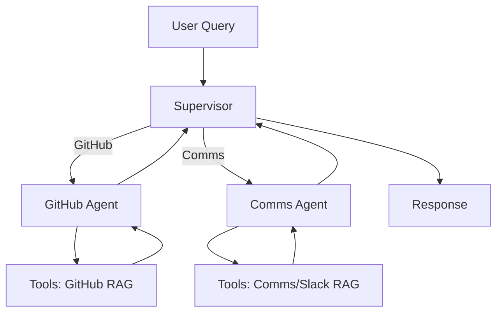

# Slask
[](https://www.python.org/downloads/)
[](https://python.langchain.com/)
[](https://langchain-ai.github.io/langgraph/)

Agentic LangChain-based RAG application for querying GitHub repositories, PlanetIX communications documents, and Slack history. Features a multi-agent supervisor system powered by LangGraph, hybrid retrieval (dense embeddings + BM25 + cross-encoder reranking), and an interactive Chainlit UI.

## 🚀 Features
- **Multi-Agent Routing**: Supervisor agent routes queries to specialized **GitHub Agent** or **PlanetIX Dispatch (Comms) Agent**.
- **Hybrid RAG**: Combines Chroma vector search, BM25 keyword matching, and BAAI/bge-reranker-v2-m3 for precise retrieval.
- **Interactive UI**: Chainlit-based chat interface with real-time streaming, tool visualization, and token tracking.
- **Tools**:
  - GitHub: Repo listing, file reading, hybrid search.
  - Comms: Search PlanetIX docs (ingested as Markdown).
  - Slack: Retrieve conversation history.
  - Utilities: Current datetime, DuckDuckGo search.
- **Embeddings & LLM**: BAAI/bge-m3 embeddings + xAI Grok (grok-4-1-fast-reasoning).
- **Slack Integration**: Optional Slack bot server.
- **Data Ingestion**: Scripts for GitHub repos, local MD files, web pages.

## 📦 Installation
1. Clone the repo (if applicable).
2. Install dependencies:
   ```bash
   uv sync  # Recommended (uv.lock provided)
   # or
   pip install -e .  # Editable install
   ```
3. Set environment variables (`.env`):
   ```
   XAI_API_KEY=your_xai_key
   SLACK_BOT_TOKEN=your_slack_token  # Optional
   SLACK_APP_TOKEN=your_slack_app_token  # Optional
   ```

## 🚀 Quick Start
```bash
python src/run_chainlit.py
```
- Opens Chainlit UI at `http://localhost:8000`.
- Chat with agents: e.g., \"What's in repo X?\" → GitHub Agent; \"PlanetIX staking info?\" → Comms Agent.

## 🏗️ Architecture
```
User Query (Chainlit UI)
    ↓
Supervisor (LangGraph)
    ├─→ GitHub Agent → Tools (retrieve_github_info, list_repos, read_file) → RAG (github.db)
    └─→ Comms Agent → Tools (retrieve_comms_info, retrieve_slack_history) → RAG (planetix_comms.db)
```
- **State Management**: In-memory checkpointer for conversations.
- **Retrieval**: Chroma DB with repo/doc metadata filtering.
- **Logging**: `logs/agent.log`, `logs/conversation_history.log`.

### Mermaid Diagram


## 📁 Project Structure
```
.
├── config/              # LLM config, system prompts, GitHub repos list
├── data/                # Ingested Comms MD files
├── ingestion/           # Ingestor scripts (GitHub, web, local MD)
├── public/              # Chainlit assets (avatars, diagrams)
├── scripts/             # RAG initialization scripts
├── src/
│   ├── agent.py         # LangGraph multi-agent graph
│   ├── app.py           # Chainlit UI integration
│   ├── retrievers.py    # Hybrid RAG retriever
│   ├── tools/           # Agent tools (@tool decorated)
│   └── slack_server.py  # Slack Bolt app
├── util/                # Utilities (progress)
└── pyproject.toml      # Dependencies (uv/pip)
```

## 🔧 Data Ingestion
Run scripts to populate vector stores:
```bash
# GitHub repos (from config/github_repositories.json)
python scripts/initialize_github_rag.py

# PlanetIX Comms docs
python scripts/initialize_local_md_rag.py

# Web pages (if needed)
python scripts/initialize_comms_web_rag.py
```
Databases: `github.db`, `planetix_comms.db`.

## ⚙️ Configuration
- `config/llm_config.py`: Embeddings (bge-m3), LLM (Grok).
- `config/github_repositories.json`: Tracked repos.
- `config/*.md`: System messages for agents/supervisor.

## 🛠️ Tools API Reference
| Tool | Agent | Description |
|------|-------|-------------|
| `retrieve_github_info` | GitHub | Hybrid search in GitHub repos |
| `list_tracked_repositories` | GitHub | List repos from config |
| `read_github_file` | GitHub | Read specific file content |
| `retrieve_comms_info` | Comms | Hybrid search in PlanetIX docs |
| `retrieve_slack_history` | Comms | Fetch Slack channel history |
| `current_datetime` | Shared | Current time |

## 🔄 Slack Bot (Optional)
```bash
python src/slack_server.py
```
Exposes `/slash` command for agent queries in Slack.

## 🧪 Development
- **Watch Mode**: `python src/run_chainlit.py` (auto-reload).
- **Debug**: Add `-d` flag.
- **Logs**: Check `logs/` directory.
- **Preload Models**: `python scripts/preload_models.py`.

## 🤝 Contributing
1. Fork & PR.
2. Run `uv sync`.
3. Add tests/docs.

## 📄 License
MIT (assumed).

## 📚 Full Documentation

See [docs/index.md](docs/index.md)

## � Acknowledgments
- [LangChain](https://langchain.com), [LangGraph](https://langgraph.com)
- [Chainlit](https://chainlit.io)
- [xAI Grok](https://x.ai)
