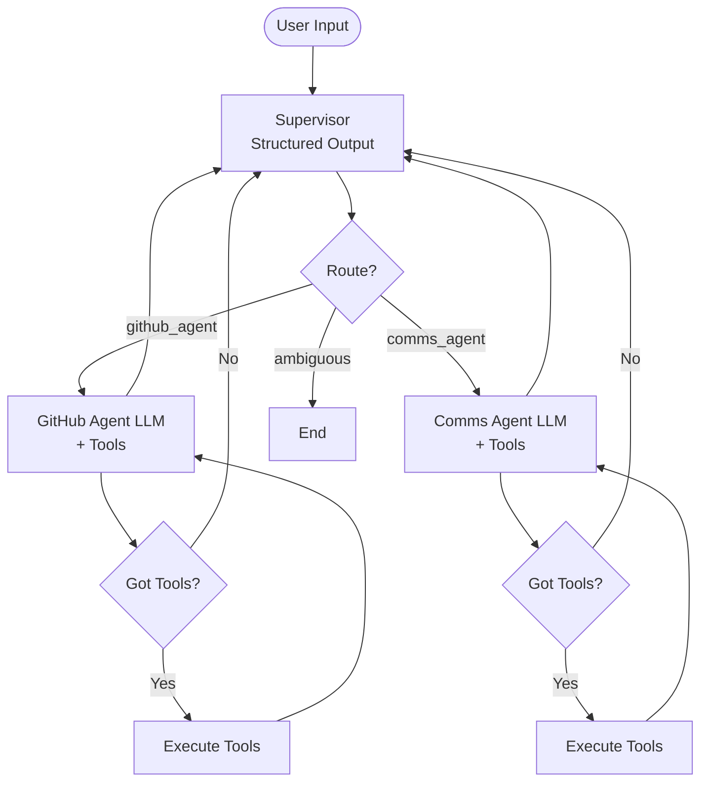
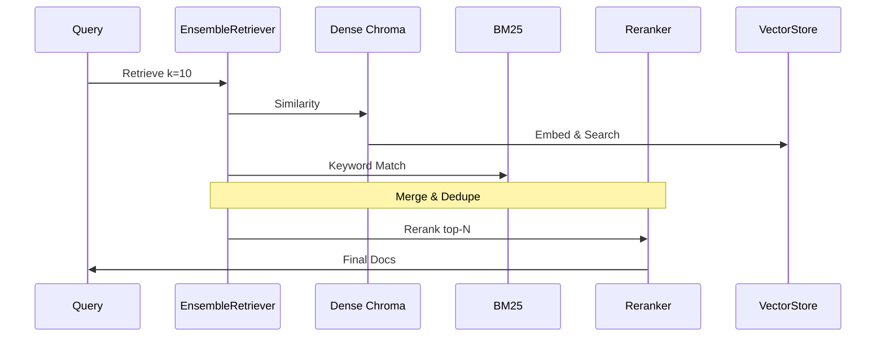

# Architecture Overview

## High-Level System Design

Slask is a **multi-agent RAG system** designed for querying technical documentation across GitHub repositories and PlanetIX communications. Key components:

1. **Frontend**: Chainlit UI for interactive chat.
2. **Agent Orchestration**: LangGraph supervisor graph routing to domain-specific agents.
3. **Retrieval**: Hybrid RAG (Chroma + BM25 + Reranker).
4. **Data Pipeline**: Ingestion scripts populating vector stores.
5. **Integrations**: Slack bot for channel queries.

## Component Diagram

```mermaid
graph TB
    subgraph UI [\"Frontend\"]
        C[Chainlit App<br/>src/app.py]
    end
    subgraph AGENTS [\"LangGraph Agents<br/>src/agent.py\"]
        S[Supervisor]
        G[GitHub Agent]
        P[PlanetIX Comms Agent]
    end
    subgraph RAG [\"Hybrid Retriever<br/>src/retrievers.py\"]
        VD[Vector DB<br/>Chroma github.db<br/>planetix_comms.db]
        BM25[BM25 Index]
        RERANK[Reranker<br/>bge-reranker-v2-m3]
    end
    subgraph TOOLS [\"Tools src/tools/*\"]
        GT[GitHub Tools]
        CT[Comms Tools]
        ST[Slack Tool]
    end
    subgraph INGEST [\"Ingestion\"]
        GI[GitHub Loader<br/>ingestion/github_ingestor.py]
        LMI[Local MD<br/>ingestion/local_md_ingestor.py]
        WI[Web Ingestor]
    end
    subgraph SLACK [\"Slack Bridge<br/>src/slack_server.py\"]
        SB[Slack Bolt + Flask]
    end

    C --> S
    S --> G
    S --> P
    G --> GT
    GT --> RAG
    P --> CT
    CT --> RAG
    RAG --> VD
    RAG --> BM25
    RAG --> RERANK
    GI --> VD
    LMI --> VD
    WI --> VD
    C --> SB
    SB --> S
```

## Agent Graph Flow (LangGraph)



## RAG Pipeline

1. **Ensemble Retrieval**:
   - Dense: Chroma similarity search (bge-m3 embeddings).
   - Sparse: BM25 keyword matching.
   - Weights: 0.5 / 0.5.

2. **Reranking**: Cross-encoder (BAAI/bge-reranker-v2-m3) top-N.

3. **Metadata Filtering**: Repo-specific for GitHub.



## Ingestion Pipeline

- **GitHub**: Clone repos (main/default branch), filter files (code/config), language-aware splitting, unique IDs (repo+source+hash).
- **Comms**: Load local MD files from `data/comms_pages_as_md/`.
- **Web**: Trafilatura for pages.

Runs via scripts: `initialize_github_rag.py`, etc.

Databases persist in `./github.db`, `./planetix_comms.db`.

## Deployment Flows

- **Chainlit**: `python src/run_chainlit.py` → localhost:8000
- **Slack**: `python src/slack_server.py` → ngrok tunnel, @bot mentions.

## Data Flow Summary

```
GitHub Repos (config) → Ingestion → Chroma DB → Hybrid Retriever → Agents → UI/Slack
PlanetIX MD → Ingestion → Chroma DB → ...
Slack History → Tool → Agent
```

## Scalability Notes
- In-memory checkpointer (sessions reset on restart).
- Model caching in retrievers.
- Batch ingestion for large repos.
