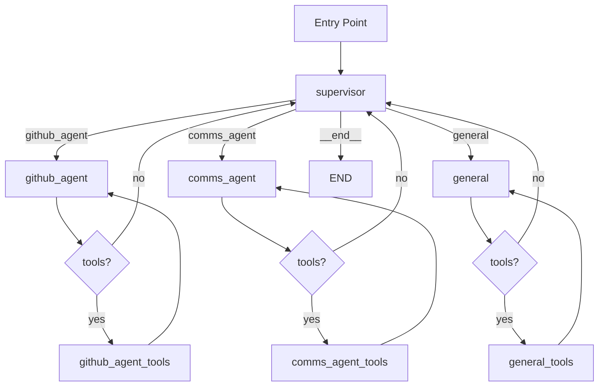

# LangGraph Supervisor System Implementation Plan

## Executive Summary

This plan outlines the implementation of a multi-agent LangGraph system featuring a **supervisor node** that dynamically routes user queries to specialized agents:

- **github_agent**: Existing GitHub-focused agent (repo management, issues).
- **comms_agent**: New communications agent (email, messaging, notifications).
- **general** (suggested addition): Handles miscellaneous queries.

Key features:

- Individual tool access with shared utilities (e.g., [`current_datetime()`](backend/tools/current_datetime.py)).
- Keyword/LLM-based routing with fallback and error handling.
- Support for multi-turn conversations via existing checkpointer.
- Integration with current Chainlit UI in [`backend/main.py`](backend/main.py).
- Logging, security, and performance considerations.

**RAG Note for comms_agent**: Vector DB (Chroma in `./chroma_doc_db`, collection `comms_docs`) is initialized via [`doc_rag_init.py`](doc_rag_init.py) using [`config/comms.json`](config/comms.json). Retrieval tool/code integration pending (user to implement later).

## 1. Tool Groupings

Separate tools to enforce access control:

```python
# In backend/agent.py, after imports
from backend.tools import current_datetime, retrieve_github_info, list_tracked_repositories
# Import new comms tools (to be implemented)
# from backend.tools import email_send, chat_notify, retrieve_comms_docs  # placeholders + RAG retriever

shared_tools = [current_datetime]
github_tools = [retrieve_github_info, list_tracked_repositories]
comms_tools = []  # e.g., [email_send, chat_notify, retrieve_comms_docs (RAG)]
general_tools = [duckduckgo_web_search]  # + shared?

github_agent_tools = shared_tools + github_tools
comms_agent_full_tools = shared_tools + comms_tools
general_full_tools = shared_tools + general_tools

github_agent_tool_dict = {tool.name: tool for tool in github_agent_tools}
comms_agent_tool_dict = {tool.name: tool for tool in comms_agent_full_tools}
general_tool_dict = {tool.name: tool for tool in general_full_tools}
```

**Note**: Update [`backend/tools/__init__.py`](backend/tools/__init__.py) to export new comms tools. The `retrieve_comms_docs` RAG tool would load the Chroma vectorstore from `./chroma_doc_db` (collection `comms_docs`) for similarity search. Implementation pending.

## 2. Agent-Specific LLMs and Executors

```python
from config.llm_config import llm_model  # existing

github_agent_llm = llm_model.bind_tools(github_agent_tools)
comms_agent_llm = llm_model.bind_tools(comms_agent_full_tools)
general_llm = llm_model.bind_tools(general_full_tools)
supervisor_llm = llm_model  # no tools
```

**Tool Executors** (reuse/adapt existing `custom_tool_executor`):

```python
def github_agent_tool_exec(state):
    return _execute_tools(state, github_agent_tool_dict)

def comms_agent_tool_exec(state):
    return _execute_tools(state, comms_agent_tool_dict)

def general_tool_exec(state):
    return _execute_tools(state, general_tool_dict)

def _execute_tools(state, tool_dict):  # Refactored common logic
    # ... (adapt from existing custom_tool_executor)
```

**Agent Calls**:

```python
def github_agent_call(state):
    system_prompt = SystemMessage(content=Path('config/system_prompt_github.txt').read_text())  # New specialized prompts?
    response = github_agent_llm.invoke([system_prompt] + state[\"messages\"])
    return {\"messages\": [response]}

# Similarly for comms_agent_call, general_call
# comms_agent_call can leverage RAG context once retrieval tool is available
```

## 3. Supervisor Node

**Logic**: LLM classifies query using keywords + reasoning.

```python
def supervisor(state):
    messages = state[\"messages\"]
    query = messages[-1].content
    
    # Keyword detection as primary, LLM for ambiguous
    if any(word in query.lower() for word in [\"github\", \"repo\", \"issue\", \"pull\"]):
        next_node = \"github_agent\"
    elif any(word in query.lower() for word in [\"email\", \"message\", \"notify\", \"comms\"]):
        next_node = \"comms_agent\"
    else:
        # LLM classify
        prompt = f\"\"\"Classify query: {query}
Options: github_agent (GitHub), comms_agent (email/msg), general (other). Respond ONLY with the agent name.\"\"\"
        response = supervisor_llm.invoke(prompt)
        next_node = response.content.strip().lower()
        if next_node not in [\"github_agent\", \"comms_agent\", \"general\"]:
            next_node = \"general\"  # fallback
    
    logger.info(f\"Routing '{query[:50]}...' to {next_node}\")
    return {\"next\": next_node, \"messages\": [AIMessage(content=f\"Routed to {next_node}\")]}
```

Error handling: Invalid -> general + human clarification message.

## 4. Graph Structure



**Code Snippet** (in `backend/agent.py`):

```python
graph = StateGraph(AgentState)

# Add nodes
graph.add_node(\"supervisor\", supervisor)
graph.add_node(\"github_agent\", github_agent_call)
graph.add_node(\"github_agent_tools\", github_agent_tool_exec)
graph.add_node(\"comms_agent\", comms_agent_call)
graph.add_node(\"comms_agent_tools\", comms_agent_tool_exec)
graph.add_node(\"general\", general_call)
graph.add_node(\"general_tools\", general_tool_exec)

graph.set_entry_point(\"supervisor\")

# Supervisor routing
graph.add_conditional_edges(
    \"supervisor\",
    lambda state: state.get(\"next\", \"general\"),
    {\"github_agent\": \"github_agent\", \"comms_agent\": \"comms_agent\", \"general\": \"general\", \"__end__\": END}
)

# Agent loops (example for github_agent)
def should_continue(state):
    last_msg = state[\"messages\"][-1]
    return \"tools\" if last_msg.tool_calls else \"supervisor\"

graph.add_conditional_edges(\"github_agent\", should_continue, {\"tools\": \"github_agent_tools\", \"supervisor\": \"supervisor\"})
graph.add_edge(\"github_agent_tools\", \"github_agent\")

# Repeat for others
```

Leverage existing edges (e.g., adapt lines 79-81).

## 5. Integration Points

- **backend/agent.py**: Full rewrite of graph (backup existing).
- **backend/main.py**: No changes (uses `app`).
- **backend/tools/**: Add comms tools directory/files, including RAG retriever (pending).
- **config/**: Add `system_prompt_github.txt`, `system_prompt_comms_agent.txt`.
- **Logging**: Extend supervisor for routing logs (use existing logger).

## 6. Testing Strategy

- **Unit Tests** (`tests/` new dir):
  - Routing: Mock queries, assert `next` node.
  - Tool Access: Verify github_agent can't call comms tools (via binding).
- **Integration**: Run Chainlit, test queries in UI.
  - GitHub query -> github_agent tools only.
  - Email query -> comms_agent.
  - Ambiguous -> general.
- **Edge Cases**: Empty query, invalid tools, multi-turn handoff.

## 7. Performance Considerations

- **Latency**: Keyword pre-filter reduces LLM calls; async tool exec.
- **Scalability**: Checkpointer supports concurrent threads; stateless supervisor.
- **Optimizations**: Cache common classifications, batch tool calls.

## 8. Additional Improvements

- **General Agent**: Added for fallback/misc (uses web_search).
- **Logging/Monitoring**: Supervisor logs decisions to file/UI.
- **Feedback Loops**: Track routing accuracy; future ML classifier.
- **Security**: Sanitize query (`re.sub(r'[<>\\\"\\\\']', '', query)`), tool input validation.
- **Multi-Turn**: Preserved via `thread_id` in config.

## Next Steps

Approve plan → Switch to `code` mode for implementation.

**Estimated Changes**: ~200-300 LOC in agent.py + new tools/prompts.
